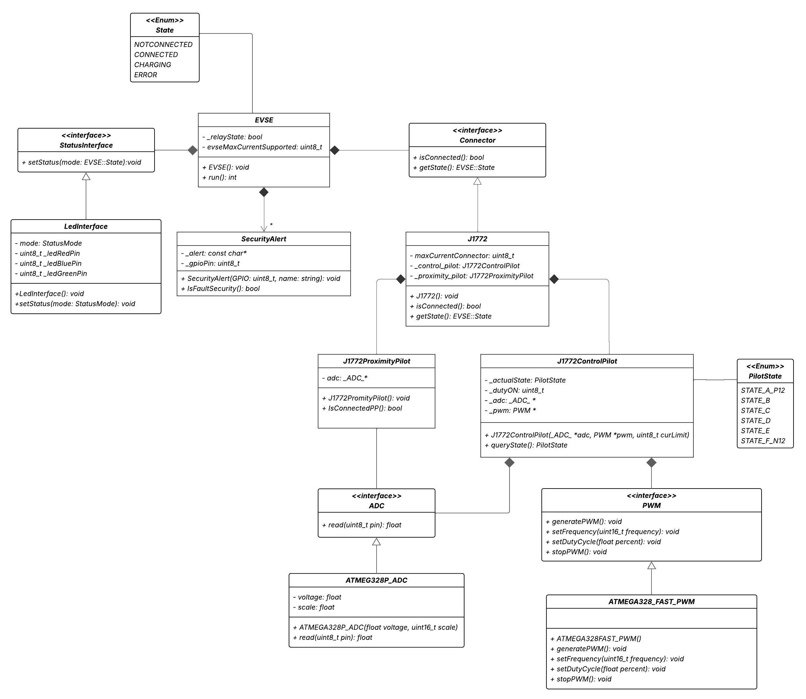

# Análise orientada a objeto
> [!NOTE]
> A **análise** orientada a objeto consiste na descrição do problema a ser tratado, duas primeiras etapas da tabela abaixo, a definição de casos de uso e a definição do domínio do problema.

## Descrição Geral do domínio do problema

Segundo a Agência Internacional de Energia (IEA), mais de 17 milhões de carros elétricos foram vendidos globalmente em 2024, representando um crescimento de 25% em relação a 2023, quando foram comercializadas cerca de 14 milhões de unidades. Em 2025, o mercado global de veículos elétricos atingiu um novo patamar: mais de 1 em cada 4 carros vendidos no mundo já é elétrico, de acordo com o relatório Global EV Outlook. As projeções da IEA indicam que essa participação deve alcançar cerca de 40% até o final da década, consolidando os veículos elétricos como protagonistas da mobilidade sustentável.

Com isto a necessidade de um carregador de veículo elétrico, se faz tão necessária tendo em vista este crescimento. Portanto a ideia deste projeto é desenvolver o firmware de um EVSE Level 1 Charger, em programação orientada a objetos C++.

---------------------------------------

O domínio do problema está centrado no controle de um sistema de carregamento de veículos elétricos (EV), especificamente utilizando um carregador AC Tipo 1. Esse tipo de carregador segue padrões como o SAE J1772, amplamente utilizado em veículos elétricos para carregamento em corrente alternada. O projeto visa desenvolver um sistema embarcado que automatize o processo de carregamento garantindo segurança, eficiência e conformidade com os estados definidos pelo protocolo.

A operação do carregamento envolve diferentes estágios que precisam ser identificados e controlados corretamente, para assim evitar possíveis falhas. Para isso, o sistema deverá interagir com o circuito de controle do carregador, sensores e atuadores (como relés, LEDs, GFCI, etc), e ser capaz de interpretar corretamente o estado de carga e conexão com o veículo, garantindo a segurança veicular e do próprio sistema.

**Requisitos Funcionais (RF)**
-  Controlar os estados de operação do carregador conforme o protocolo do Tipo 1 (ex: Desconectado, Conectado, Carregando, Erro), a partir do conector "*Control Pilot* (CP)".

- Acionar e desligar os relés das fases conforme o estado de carregamento.

- Identificar a conexão com o veículo elétrico por meio do sinal de controle "*Proximity Pilot* (PP)".

-  Indicar o estado atual do carregamento com LEDs (ex: Vermelho -> Desconectado, Azul -> Conectado, Verde -> Carregando, Amarelo -> Erro).

-  Monitorar e reagir a falhas de conexão, fuga de corrente e falta de terra.

**Requisitos Não Funcionais (RNF)**

-  Deve garantir a segurança do carregamento, evitando acionamento de relés fora dos estados apropriados.

## Diagrama de Casos de Uso

 
## Diagrama de Domínio do problema

[Retroceder](README.md) | [Avançar](projeto.md)

