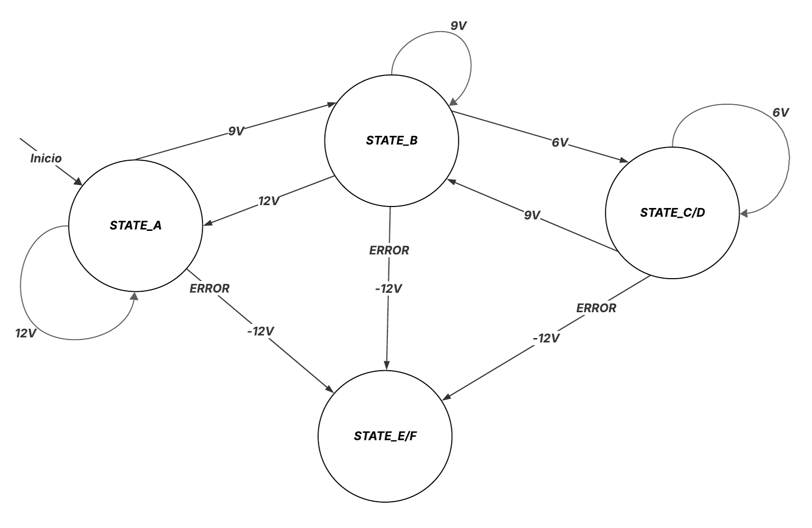

# Metodologia

O desenvolvimento do hardware foi conduzido com base nas especificações e descrições técnicas disponibilizadas pela documentação do OpenEVSE, servindo como referência para o projeto dos circuitos de controle e segurança elétrica. Já o software foi implementado em C++, utilizando a modelagem Unified Modeling Language (UML) para estruturar a arquitetura do sistema. Essa metodologia permitiu uma organização modular do código, garantindo a separação de responsabilidades entre os componentes, além de facilitar a manutenção, os testes e futuras expansões do sistema.

# Análise orientada a objeto

## Descrição Geral do domínio do problema

O domínio deste projeto está centrado no controle de um sistema de carregamento para veículos elétricos (EV), especificamente utilizando um carregador AC do Tipo 1. Este tipo de carregador segue o padrão SAE J1772, amplamente adotado na indústria automotiva para o carregamento em corrente alternada.

O objetivo do projeto é desenvolver um sistema embarcado que automatize o processo de carregamento, assegurando conformidade com os estados definidos pelo protocolo, além de garantir segurança e eficiência operacional.

Um dos principais diferenciais da proposta é a adoção de uma abordagem orientada a objetos desde o início do desenvolvimento. A arquitetura do software será projetada de forma genérica e robusta, de modo a facilitar a extensibilidade do sistema. Isso significa que, futuramente, a adição de novos componentes — como displays LCD, conectores adicionais, ou novos mecanismos de segurança — poderá ser feita de forma modular, sem a necessidade de alterações significativas na estrutura do código existente.

Essa flexibilidade é viabilizada por um dos principais paradigmas da programação orientada a objetos: o uso de herança e polimorfismo. Ao estruturar o sistema com classes base bem definidas e interfaces claras, novos módulos poderão ser integrados ao sistema com o mínimo de acoplamento, promovendo reutilização de código e manutenção facilitada.

**Requisitos Funcionais (RF)**
-  Controlar os estados de operação do carregador conforme o protocolo do Tipo 1 (ex: Desconectado, Conectado, Carregando, Erro), a partir do conector "*Control Pilot* (CP)".

- Acionar e desligar os relés das fases conforme o estado de carregamento.

- Identificar a conexão com o veículo elétrico por meio do sinal de controle "*Proximity Pilot* (PP)".

-  Indicar o estado atual do carregamento com LEDs (ex: Vermelho -> Desconectado, Azul -> Conectado, Verde -> Carregando, Amarelo -> Erro).

-  Monitorar e reagir a falhas de conexão, fuga de corrente e falta de terra.

**Requisitos Não Funcionais (RNF)**

-  Deve garantir a segurança do carregamento, evitando acionamento de relés fora dos estados apropriados.

---

## Diagrama de Casos de Uso

---

## Máquina de Estados

Funcionamento base do sistema de carregamento para o conector J1772.

[⬅️ Retroceder](README.md) | [Avançar ➡️](projeto.md)

