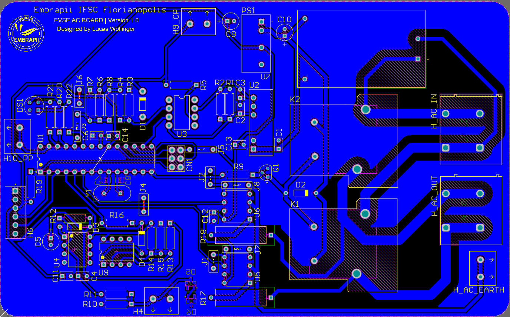
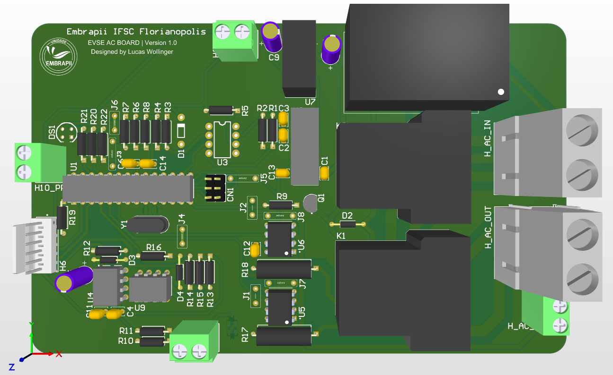
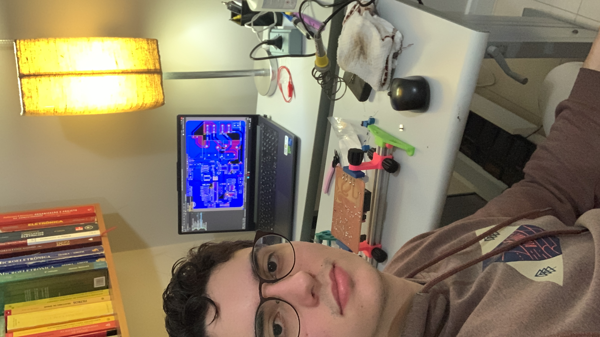

# 🚀 Implementação

> **Nota**  
> Relatar o processo de implementação do problema, incluindo as ferramentas e bibliotecas utilizadas.

A implementação do projeto foi realizada utilizando ferramentas de desenvolvimento embarcado e de desenho eletrônico. O processo envolveu tanto a parte de software (firmware) quanto a de hardware (placa do carregador).

## 🛠️ Ferramentas Utilizadas

- **Altium Designer** – Projeto da placa de circuito impresso (PCB);
- **Proteus 8.16** – Simulação de circuitos;
- **Atmel Studio** – Desenvolvimento do firmware em C para ATmega328P;
- **Git/GitHub** – Controle de versão do projeto;
- **VS Code + PlatformIO** – Alternativa usada em testes locais;
- **Multímetro e Fonte AC** – Testes em bancada.
- **USBasp** - Programador que permite gravar firmware e bootloaders em microcontroladores AVR;

---
## 📚 Bibliotecas Utilizadas
- **avr/io.h** – Biblioteca AVR C (avr-libc) que fornece definições para acessar e controlar os pinos de entrada/saída (IO) e registradores de funções especiais (SFRs) dos microcontroladores Atmel AVR;

---

## 🖼️ Visual da Placa no Altium

  
  
   
  <em>Figura: Layout da PCB desenvolvida no Altium Designer</em>

---

## 🧑‍🏭 Soldagem da PCI

  
  
   
  <em>Figura: Desenvolvimento da Soldagem da PCI</em>

---

[⬅️ Retroceder](projeto.md) | [🏠 Início](analise.md)

