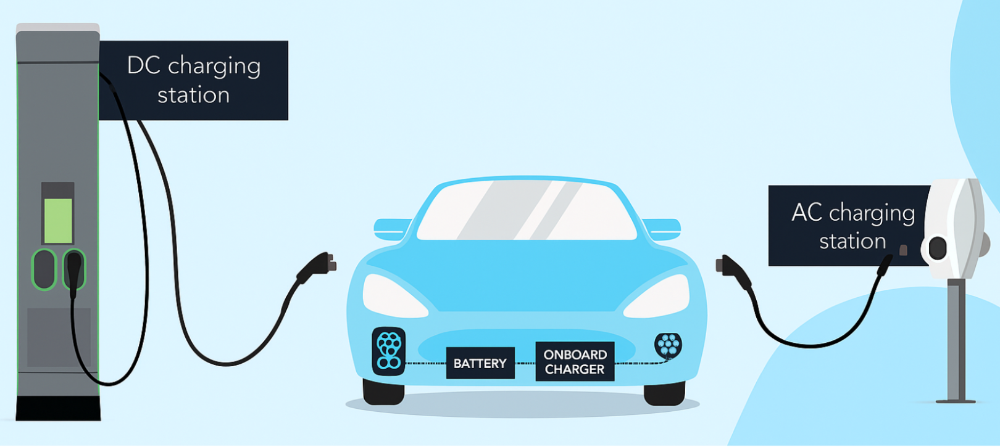

# Introdução

Segundo o U.S. Department of Transportation (2025), as estações de recarga de veículos elétricos se dividem em três tipos, como apresentados na Figura 1: o Tipo 1 (IEC 62196.2), monofásico é usado na América do Norte e Ásia, com potência de 3,7 a 7,4 kW, ideal para uso residencial; o Tipo 2 (IEC 62196.2), monofásico ou trifásico, é amplamente adotado na Europa, alcançando até 22 kW, comum em residências e comércios; o Tipo 3 (IEC 62196.3), de corrente contínua, exigindo uma infraestrutura robusta, mas possibilitando recargas muito mais rápidas.

<em>Figura 1 - Exemplo ilustrativo dos Carregadores CA (AC Charging Station) e CC (DC Charging Station)<em>
  
   
  <em>Fonte: Adaptado de EVBox (2025).</em>

Segundo o padrão SAE J1772, o processo padrão de carregamento de veículos elétricos é estabelecido a partir de diferentes estados operacionais definidos pela tensão presente entre os terminais de controle piloto (CP) e proteção de terra (PE). Cada nível de tensão, apresentado na Tabela 1, corresponde a uma condição específica do sistema e durante o estado de carga. No estado C uma frequência de 1 kHz com ciclo ativo indica a corrente máxima suportada pelo sistema, variando entre 10% e 96%. Essa lógica de estados garante o padrão de comunicação básica entre a estação de recarga e o veículo, assegurando tanto a segurança elétrica quanto a compatibilidade no processo de carregamento.

Tabela 1 — Estados da estação de recarga

| **Base Status** | **Estado** | **Tensão CP-PE** |
|:----------------:|:-----------:|:----------------:|
| Status A         | Em Espera              | +12 V            |
| Status B         | Veículo Conectado      | +9 ± 1 V         |
| Status C         | Pronto (carregando)    | +6 ± 1 V         |
| Status D         | Com Ventilação         | +3 ± 1 V         |
| Status E         | Desenergizado          | 0 V              |
| Status F         | Erro                   | −12 V            |

*Fonte: Adaptado de SAE J1772 (2017).*

