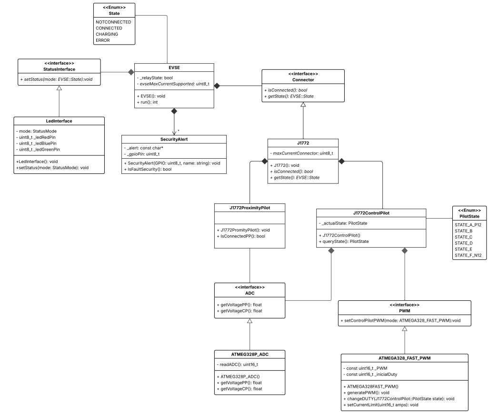

# Projeto orientado a objeto

O diagrama de classes representa a estrutura modular do firmware do EVSE (Electric Vehicle Supply Equipment) Tipo 1, com foco no protocolo J1772, utilizado amplamente na América do Norte. Ele foi projetado para garantir clareza na separação de responsabilidades, facilitar a manutenção do código e permitir escalabilidade futura do sistema.

## Diagrama de Classe

---

[⬅️ Retroceder](analise.md) | [Avançar ➡️](implementacao.md)

