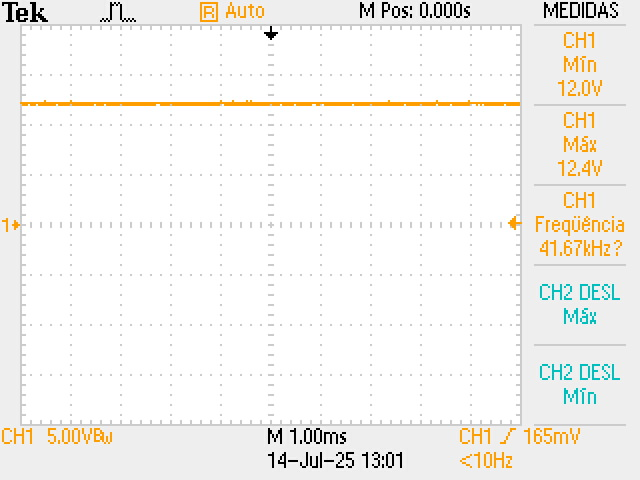
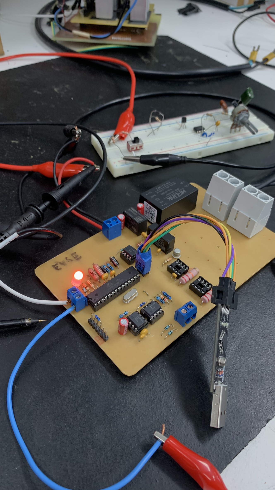
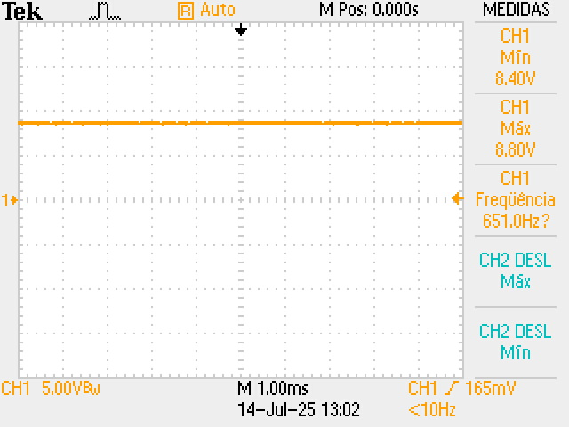
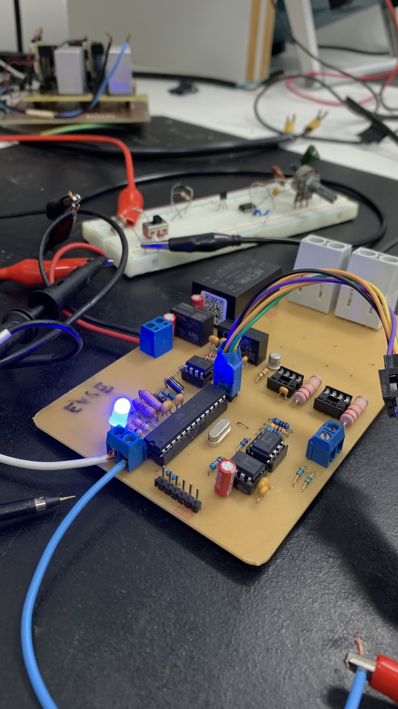
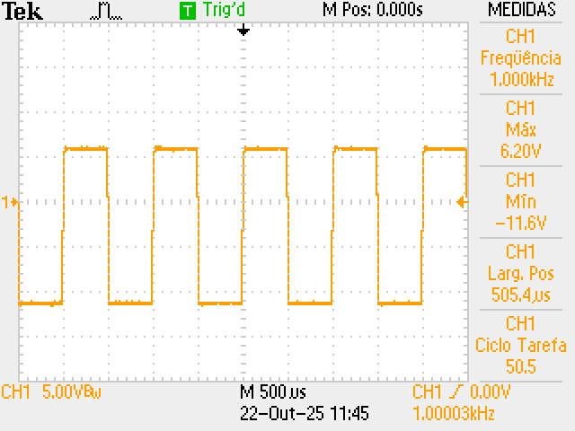
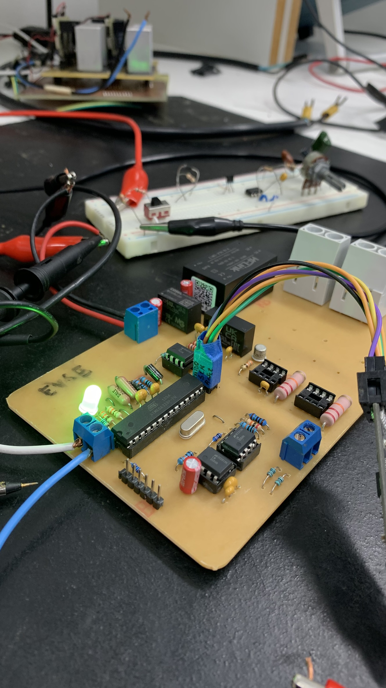
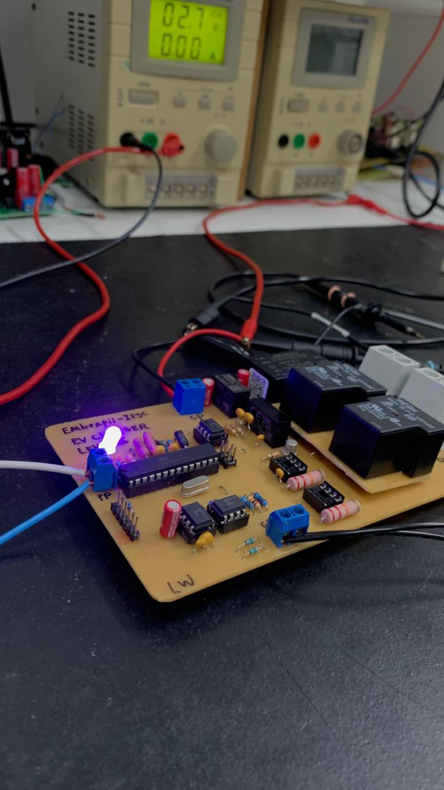
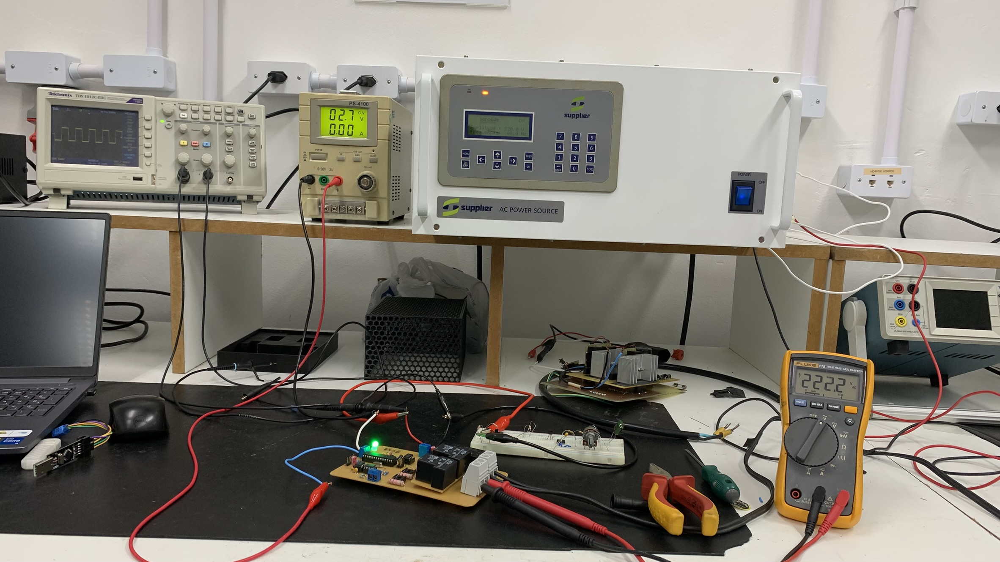

# Testes

O processo de testes após a realização do software embarcado foi baseado em duas etapas:

### 1. Testes Iniciais no Software Proteus

- Teste dos LEDs de sinalização;
- Teste dos relés de controle;
- Geração do sinal PWM e mudança de estados conforme a lógica da máquina de estados J1772;
- Identificação da conexão com o sinal **Proximity Pilot**.

### 2. Testes em Bancada com o Hardware do Carregador Level 1

- Validação de todos os testes realizados no Proteus;
- Execução completa da máquina de estados no ambiente real de hardware;
- Avaliação do comportamento dos componentes em tempo real.

---
#### 2.1 Teste Estado A - Não Conectado

  
  
   
  <em>Figura: Estado A</em>

--- 
#### 2.2 Teste Estado B - Conectado Não Carregando

  
  
   
  <em>Figura: Estado B</em>

--- 
#### 2.3 Teste Estado C - Carregando

  
  
   
  <em>Figura: Estado C</em>

---
#### 2.4 Teste Estado E - Desernegizado

  
  
   
  <em>Figura: Estado E</em>

---
### 3. Resultado Final

  
   
  <em>Figura: Estado C com Acionando os Relés</em>

--- 

[⬅️ Retroceder](implementacao.md) | [Avançar ➡️](resultado.md)

